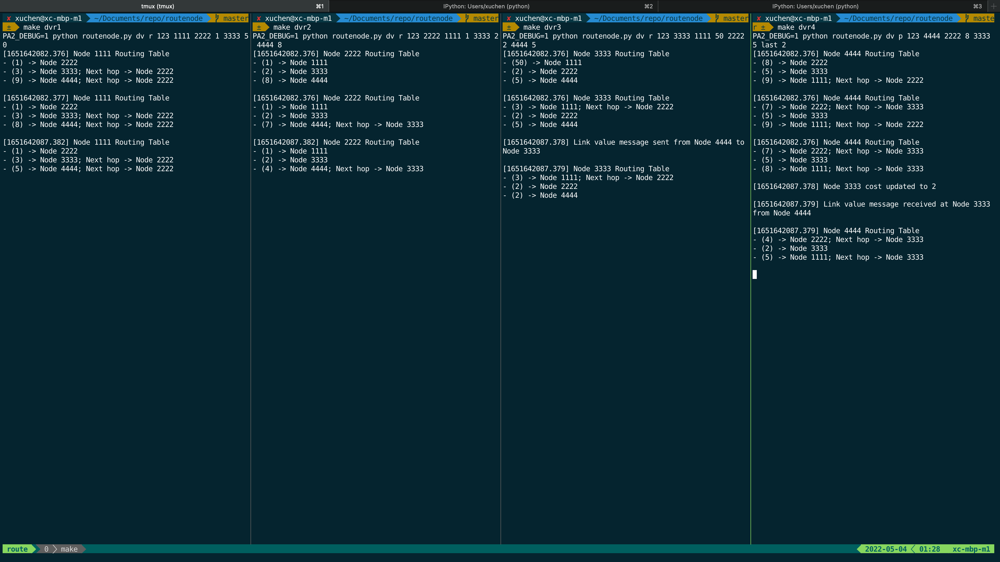
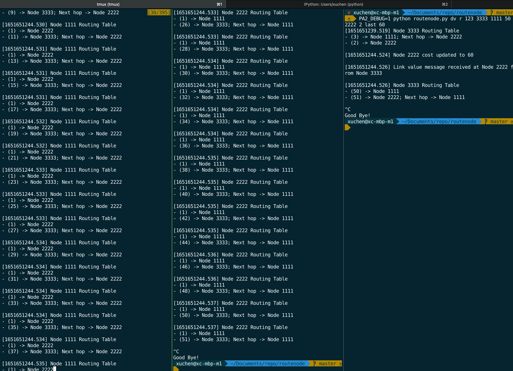
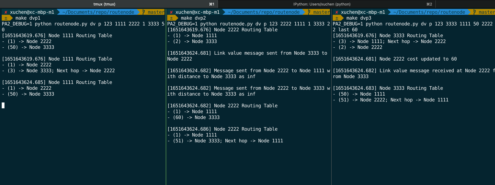
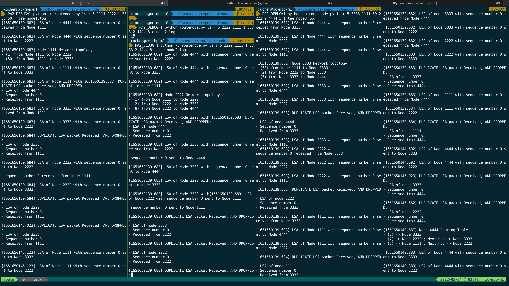

test
===

I use a enviroment variable `PA2_DEBUG` to set a short interval for cost-change


test-case 1
===
## distance vector (regular mode)



### node 1
```bash
$ make dvr1
PA2_DEBUG=1 python routenode.py dv r 123 1111 2222 1 3333 50
[1651642082.376] Node 1111 Routing Table
- (1) -> Node 2222
- (3) -> Node 3333; Next hop -> Node 2222
- (9) -> Node 4444; Next hop -> Node 2222

[1651642082.377] Node 1111 Routing Table
- (1) -> Node 2222
- (3) -> Node 3333; Next hop -> Node 2222
- (8) -> Node 4444; Next hop -> Node 2222


# after 30 seconds (actually 5 seconds because I set DEBUG=True)
[1651642087.382] Node 1111 Routing Table
- (1) -> Node 2222
- (3) -> Node 3333; Next hop -> Node 2222
- (5) -> Node 4444; Next hop -> Node 2222

^C
Good Bye!
```

### node 2
```bash
$ make dvr2
PA2_DEBUG=1 python routenode.py dv r 123 2222 1111 1 3333 2 4444 8
[1651642082.376] Node 2222 Routing Table
- (1) -> Node 1111
- (2) -> Node 3333
- (8) -> Node 4444

[1651642082.376] Node 2222 Routing Table
- (1) -> Node 1111
- (2) -> Node 3333
- (7) -> Node 4444; Next hop -> Node 3333

# after 5 seconds
[1651642087.382] Node 2222 Routing Table
- (1) -> Node 1111
- (2) -> Node 3333
- (4) -> Node 4444; Next hop -> Node 3333

^C
Good Bye!
```

### node 3
```bash
$ make dvr3
PA2_DEBUG=1 python routenode.py dv r 123 3333 1111 50 2222 2 4444 5
[1651642082.376] Node 3333 Routing Table
- (50) -> Node 1111
- (2) -> Node 2222
- (5) -> Node 4444

[1651642082.376] Node 3333 Routing Table
- (3) -> Node 1111; Next hop -> Node 2222
- (2) -> Node 2222
- (5) -> Node 4444

[1651642087.378] Link value message sent from Node 4444 to Node 3333

[1651642087.379] Node 3333 Routing Table
- (3) -> Node 1111; Next hop -> Node 2222
- (2) -> Node 2222
- (2) -> Node 4444

^C
Good Bye!
```

### node 4
```bash
$ make dvr4
PA2_DEBUG=1 python routenode.py dv p 123 4444 2222 8 3333 5 last 2
[1651642082.376] Node 4444 Routing Table
- (8) -> Node 2222
- (5) -> Node 3333
- (9) -> Node 1111; Next hop -> Node 2222

[1651642082.376] Node 4444 Routing Table
- (7) -> Node 2222; Next hop -> Node 3333
- (5) -> Node 3333
- (9) -> Node 1111; Next hop -> Node 2222

[1651642082.376] Node 4444 Routing Table
- (7) -> Node 2222; Next hop -> Node 3333
- (5) -> Node 3333
- (8) -> Node 1111; Next hop -> Node 3333

[1651642087.378] Node 3333 cost updated to 2

[1651642087.379] Link value message received at Node 3333 from Node 4444

[1651642087.379] Node 4444 Routing Table
- (4) -> Node 2222; Next hop -> Node 3333
- (2) -> Node 3333
- (5) -> Node 1111; Next hop -> Node 3333

^C
Good Bye!
```


## distance vector (regular count to infinity) 




The arguments are the same as above except mode is "r"

I only show output from node1
### node 1
```
PA2_DEBUG=1 python routenode.py dv p 123 1111 2222 1 3333 50

[1651651239.519] Node 1111 Routing Table
- (1) -> Node 2222
- (50) -> Node 3333

[1651651239.519] Node 1111 Routing Table
- (1) -> Node 2222
- (3) -> Node 3333; Next hop -> Node 2222

[1651651244.529] Node 1111 Routing Table
- (1) -> Node 2222
- (5) -> Node 3333; Next hop -> Node 2222

[1651651244.529] Node 1111 Routing Table
- (1) -> Node 2222
- (7) -> Node 3333; Next hop -> Node 2222

[1651651244.530] Node 1111 Routing Table
- (1) -> Node 2222
- (9) -> Node 3333; Next hop -> Node 2222

[1651651244.530] Node 1111 Routing Table
- (1) -> Node 2222
- (11) -> Node 3333; Next hop -> Node 2222

[1651651244.531] Node 1111 Routing Table
- (1) -> Node 2222
- (13) -> Node 3333; Next hop -> Node 2222

[1651651244.531] Node 1111 Routing Table
- (1) -> Node 2222
- (15) -> Node 3333; Next hop -> Node 2222

[1651651244.531] Node 1111 Routing Table
- (1) -> Node 2222
- (17) -> Node 3333; Next hop -> Node 2222

[1651651244.532] Node 1111 Routing Table
- (1) -> Node 2222
- (19) -> Node 3333; Next hop -> Node 2222

[1651651244.532] Node 1111 Routing Table
- (1) -> Node 2222
- (21) -> Node 3333; Next hop -> Node 2222

[1651651244.533] Node 1111 Routing Table
- (1) -> Node 2222
- (23) -> Node 3333; Next hop -> Node 2222

[1651651244.533] Node 1111 Routing Table
- (1) -> Node 2222
- (25) -> Node 3333; Next hop -> Node 2222

[1651651244.533] Node 1111 Routing Table
- (1) -> Node 2222
- (27) -> Node 3333; Next hop -> Node 2222

[1651651244.534] Node 1111 Routing Table
- (1) -> Node 2222
- (29) -> Node 3333; Next hop -> Node 2222

[1651651244.534] Node 1111 Routing Table
- (1) -> Node 2222
- (31) -> Node 3333; Next hop -> Node 2222

[1651651244.534] Node 1111 Routing Table
- (1) -> Node 2222
- (33) -> Node 3333; Next hop -> Node 2222

[1651651244.534] Node 1111 Routing Table
- (1) -> Node 2222
- (35) -> Node 3333; Next hop -> Node 2222

[1651651244.534] Node 1111 Routing Table
- (1) -> Node 2222
- (37) -> Node 3333; Next hop -> Node 2222

[1651651244.535] Node 1111 Routing Table
- (1) -> Node 2222
- (39) -> Node 3333; Next hop -> Node 2222

[1651651244.535] Node 1111 Routing Table
- (1) -> Node 2222
- (41) -> Node 3333; Next hop -> Node 2222

[1651651244.535] Node 1111 Routing Table
- (1) -> Node 2222
- (43) -> Node 3333; Next hop -> Node 2222

[1651651244.536] Node 1111 Routing Table
- (1) -> Node 2222
- (45) -> Node 3333; Next hop -> Node 2222

[1651651244.536] Node 1111 Routing Table
- (1) -> Node 2222
- (47) -> Node 3333; Next hop -> Node 2222

[1651651244.536] Node 1111 Routing Table
- (1) -> Node 2222
- (49) -> Node 3333; Next hop -> Node 2222

[1651651244.537] Node 1111 Routing Table
- (1) -> Node 2222
- (50) -> Node 3333
```
### node 2

### node 3

## distance vector (poison reverse mode)


### node 1
```bash
$ make dvp1
PA2_DEBUG=1 python routenode.py dv p 123 1111 2222 1 3333 50
[1651643619.676] Node 1111 Routing Table
- (1) -> Node 2222
- (50) -> Node 3333

[1651643619.676] Node 1111 Routing Table
- (1) -> Node 2222
- (3) -> Node 3333; Next hop -> Node 2222

# after 5 seconds 
[1651643624.685] Node 1111 Routing Table
- (1) -> Node 2222
- (50) -> Node 3333
```

### node 2
```bash
$ make dvp2
PA2_DEBUG=1 python routenode.py dv p 123 2222 1111 1 3333 2
[1651643619.676] Node 2222 Routing Table
- (1) -> Node 1111
- (2) -> Node 3333

[1651643624.681] Link value message sent from Node 3333 to Node 2222

[1651643624.682] Message sent from Node 2222 to Node 1111 with distance to Node 3333 as inf

[1651643624.682] Message sent from Node 2222 to Node 3333 with distance to Node 3333 as inf

[1651643624.682] Node 2222 Routing Table
- (1) -> Node 1111
- (60) -> Node 3333

[1651643624.686] Node 2222 Routing Table
- (1) -> Node 1111
- (51) -> Node 3333; Next hop -> Node 1111
```

### node 3
```bash
$ make dvp3
PA2_DEBUG=1 python routenode.py dv p 123 3333 1111 50 2222 2 last 60
[1651643619.676] Node 3333 Routing Table
- (3) -> Node 1111; Next hop -> Node 2222
- (2) -> Node 2222

[1651643624.681] Node 2222 cost updated to 60

[1651643624.682] Link value message received at Node 2222 from Node 3333

[1651643624.683] Node 3333 Routing Table
- (50) -> Node 1111
- (51) -> Node 2222; Next hop -> Node 1111
```

test-case 3
===
In this case I set `ROUTING_INTERVAL = 10`

if the following output is too long and too hard to read,

please check log file under `resource` folder




### node 1
```
PA2_DEBUG=1 python -u routenode.py ls r 5 1111 2222 1 3333 50 | tee node1.log
[1651650139.682] LSA of node 4444 with sequence number 0 received from Node 1111

[1651650139.683] LSA of Node 4444 with sequence number 0 sent to Node 2222

[1651650139.683] Node 1111 Network topology
- (1) from Node 1111 to Node 2222
- (50) from Node 1111 to Node 3333

[1651650139.683] LSA of Node 1111 with sequence number 0 sent to Node 3333

[1651650139.683] LSA of Node 1111 with[1651650139.683] DUPLICATE LSA packet Received, AND DROPPED:
- LSA of node 4444
- Sequence number 0
- Received from 1111

[1651650139.683] LSA of node 3333 with sequence number 0 received from Node 1111

[1651650139.683] LSA of Node 3333 with sequence number 0 sent to Node 2222

[1651650139.684] DUPLICATE LSA packet Received, AND DROPPED:
- LSA of node 3333
- Sequence number 0
- Received from 1111

[1651650139.684] LSA of node 2222 with sequence number 0 sent to Node 2222

 sequence number 0 received from Node 1111

[1651650139.684] LSA of Node 2222 with sequence number 0 sent to Node 3333

[1651650139.684] DUPLICATE LSA packet Received, AND DROPPED:
- LSA of node 2222
- Sequence number 0
- Received from 1111

[1651650145.023] DUPLICATE LSA packet Received, AND DROPPED:
- LSA of node 3333
- Sequence number 0
- Received from 1111

[1651650145.123] LSA of Node 1111 with sequence number 0 sent to Node 3333

[1651650145.123] LSA of Node 1111 with sequence number 0 sent to Node 2222

[1651650145.663] DUPLICATE LSA packet Received, AND DROPPED:
- LSA of node 2222
- Sequence number 0
- Received from 1111

[1651650149.689] Node 1111 Routing Table
- (1) -> Node 2222
- (3) -> Node 3333 ; Next hop -> Node 2222
- (8) -> Node 4444 ; Next hop -> Node 3333

[1651650150.152] LSA of Node 1111 with sequence number 0 sent to Node 3333

[1651650150.152] LSA of Node 1111 with sequence number 0 sent to Node 2222

[1651650150.743] DUPLICATE LSA packet Received, AND DROPPED:
- LSA of node 2222
- Sequence number 0
- Received from 1111

[1651650150.784] DUPLICATE LSA packet Received, AND DROPPED:
- LSA of node 3333
- Sequence number 0
- Received from 1111

[1651650151.689] LSA of node 3333 with sequence number 1 received from Node 1111

[1651650151.689] LSA of Node 3333 with sequence number 1 sent to Node 2222

[1651650151.689] LSA of node 4444 with sequence number 1 received from Node 1111

[1651650151.690] LSA of Node 4444 with sequence number 1 sent to Node 2222

[1651650151.690] Node 1111 Network topology
- (1) from Node 1111 to Node 2222
- (50) from Node 1111 to Node 3333

[1651650151.690] Node 1111 Routing Table
- (1) -> Node 2222
- (3) -> Node 3333 ; Next hop -> Node 2222
- (9) -> Node 4444 ; Next hop -> Node 2222

[1651650151.690] DUPLICATE LSA packet Received, AND DROPPED:
- LSA of node 4444
- Sequence number 1
- Received from 1111

[1651650151.690] DUPLICATE LSA packet Received, AND DROPPED:
- LSA of node 3333
- Sequence number 1
- Received from 1111
```

### node 2

```
$ PA2_DEBUG=1 python -u routenode.py ls r 5 2222 1111 1 3333 2 4444 8 | tee node2.log

[1651650139.682] LSA of node 4444 with sequence number 0 received from Node 2222

[1651650139.682] LSA of Node 4444 with sequence number 0 sent to Node 3333

[1651650139.682] LSA of Node 4444 with sequence number 0 sent to Node 1111

[1651650139.682] Node 2222 Network topology
- (1) from Node 1111 to Node 2222
- (2) from Node 2222 to Node 3333
- (8) from Node 2222 to Node 4444

[1651650139.682] LSA of Node 2222 with[1651650139.683] DUPLICATE LSA packet Received, AND DROPPED:
- LSA of node 4444
- Sequence number 0
- Received from 2222

[1651650139.683] LSA of node 3333 with sequence number 0 received from Node 2222

 sequence number 0 sent to Node 4444

[1651650139.683] LSA of Node 3333 with sequence number 0 sent to Node 4444

[1651650139.683] LSA of Node 2222 with sequence number 0 sent to Node 3333

[1651650139.683] LSA of Node 3333 with[1651650139.683] LSA of Node 2222 with sequence number 0 sent to Node 1111

 sequence number 0 sent to Node 1111

[1651650139.683] DUPLICATE LSA packet Received, AND DROPPED:
- LSA of node 3333
- Sequence number 0
- Received from 2222

[1651650139.683] DUPLICATE LSA packet Received, AND DROPPED:
- LSA of node 2222
- Sequence number 0
- Received from 2222

[1651650139.683] DUPLICATE LSA packet Received, AND DROPPED:
- LSA of node 4444
- Sequence number 0
- Received from 2222

[1651650139.683] LSA of node 1111 with sequence number 0 received from Node 2222

[1651650139.683] LSA of Node 1111 with sequence number 0 sent to Node 4444

[1651650139.684] LSA of Node 1111 with sequence number 0 sent to Node 3333

[1651650139.684] DUPLICATE LSA packet Received, AND DROPPED:
- LSA of node 3333
- Sequence number 0
- Received from 2222

[1651650139.684] DUPLICATE LSA packet Received, AND DROPPED:
- LSA of node 1111
- Sequence number 0
- Received from 2222

[1651650139.684] DUPLICATE LSA packet Received, AND DROPPED:
- LSA of node 1111
- Sequence number 0
- Received from 2222

[1651650144.693] DUPLICATE LSA packet Received, AND DROPPED:
- LSA of node 4444
- Sequence number 0
- Received from 2222

[1651650145.023] DUPLICATE LSA packet Received, AND DROPPED:
- LSA of node 3333
- Sequence number 0
- Received from 2222

[1651650145.123] DUPLICATE LSA packet Received, AND DROPPED:
- LSA of node 1111
- Sequence number 0
- Received from 2222

[1651650145.662] LSA of Node 2222 with sequence number 0 sent to Node 4444

[1651650145.662] LSA of Node 2222 with sequence number 0 sent to Node 3333

[1651650145.662] LSA of Node 2222 with sequence number 0 sent to Node 1111

[1651650149.687] Node 2222 Routing Table
- (1) -> Node 1111
- (2) -> Node 3333
- (7) -> Node 4444 ; Next hop -> Node 3333

[1651650149.884] DUPLICATE LSA packet Received, AND DROPPED:
- LSA of node 4444
- Sequence number 0
- Received from 2222

[1651650150.152] DUPLICATE LSA packet Received, AND DROPPED:
- LSA of node 1111
- Sequence number 0
- Received from 2222

[1651650150.743] LSA of Node 2222 with sequence number 0 sent to Node 4444

[1651650150.743] LSA of Node 2222 with sequence number 0 sent to Node 3333

[1651650150.743] LSA of Node 2222 with sequence number 0 sent to Node 1111

[1651650150.784] DUPLICATE LSA packet Received, AND DROPPED:
- LSA of node 3333
- Sequence number 0
- Received from 2222

[1651650151.688] LSA of node 4444 with sequence number 1 received from Node 2222

[1651650151.688] LSA of Node 4444 with sequence number 1 sent to Node 3333

[1651650151.688] LSA of Node 4444 with sequence number 1 sent to Node 1111

[1651650151.689] LSA of node 3333 with sequence number 1 received from Node 2222

[1651650151.689] LSA of Node 3333 with sequence number 1 sent to Node 4444

[1651650151.689] LSA of Node 3333 with sequence number 1 sent to Node 1111

[1651650151.689] Node 2222 Network topology
- (1) from Node 1111 to Node 2222
- (2) from Node 2222 to Node 3333
- (8) from Node 2222 to Node 4444

[1651650151.689] Node 2222 Routing Table
- (1) -> Node 1111
- (2) -> Node 3333
- (8) -> Node 4444

[1651650151.689] DUPLICATE LSA packet Received, AND DROPPED:
- LSA of node 4444
- Sequence number 1
- Received from 2222

[1651650151.690] DUPLICATE LSA packet Received, AND DROPPED:
- LSA of node 3333
- Sequence number 1
- Received from 2222

[1651650151.690] DUPLICATE LSA packet Received, AND DROPPED:
- LSA of node 3333
- Sequence number 1
- Received from 2222

[1651650151.690] DUPLICATE LSA packet Received, AND DROPPED:
- LSA of node 4444
- Sequence number 1
- Received from 2222
```

### node 3
```
$ PA2_DEBUG=1 python -u routenode.py ls r 5 3333 1111 50 2222 2 4444 5 | tee node3.log

[1651650139.682] LSA of node 4444 with sequence number 0 received from Node 3333

[1651650139.682] LSA of Node 4444 with sequence number 0 sent to Node 2222

[1651650139.682] LSA of Node 4444 with sequence number 0 sent to Node 1111

[1651650139.682] Node 3333 Network topology
- (50) from Node 1111 to Node 3333
- (2) from Node 2222 to Node 3333
- (5) from Node 3333 to Node 4444

[1651650139.682] LSA of Node 3333 with sequence number 0 sent to Node 4444

[1651650139.682] LSA of Node 3333 with sequence number 0 sent to Node 2222

[1651650139.683] DUPLICATE LSA packet Received, AND DROPPED:
- LSA of node 4444
- Sequence number 0
- Received from 3333

[1651650139.683] LSA of Node 3333 with sequence number 0 sent to Node 1111
[1651650139.683] LSA of node 2222 with 
sequence number 0 received from Node 3333

[1651650139.683] LSA of Node 2222 with sequence number 0 sent to Node 2222

[1651650139.683] LSA of Node 2222 with sequence number 0 sent to Node 1111

[1651650139.683] DUPLICATE LSA packet Received, AND DROPPED:
- LSA of node 2222
- Sequence number 0
- Received from 3333

[1651650139.683] LSA of node 1111 with sequence number 0 received from Node 3333

[1651650139.683] LSA of Node 1111 with sequence number 0 sent to Node 4444

[1651650139.683] LSA of Node 1111 with sequence number 0 sent to Node 2222

[1651650139.684] DUPLICATE LSA packet Received, AND DROPPED:
- LSA of node 1111
- Sequence number 0
- Received from 3333

[1651650139.684] DUPLICATE LSA packet Received, AND DROPPED:
- LSA of node 2222
- Sequence number 0
- Received from 3333

[1651650144.693] DUPLICATE LSA packet Received, AND DROPPED:
- LSA of node 4444
- Sequence number 0
- Received from 3333

[1651650145.023] LSA of Node 3333 with sequence number 0 sent to Node 4444

[1651650145.023] LSA of Node 3333 with sequence number 0 sent to Node 2222

[1651650145.023] LSA of Node 3333 with sequence number 0 sent to Node 1111

[1651650145.123] DUPLICATE LSA packet Received, AND DROPPED:
- LSA of node 1111
- Sequence number 0
- Received from 3333

[1651650145.663] DUPLICATE LSA packet Received, AND DROPPED:
- LSA of node 2222
- Sequence number 0
- Received from 3333

[1651650149.687] Node 3333 Routing Table
- (2) -> Node 2222
- (3) -> Node 1111 ; Next hop -> Node 2222
- (5) -> Node 4444

[1651650149.883] DUPLICATE LSA packet Received, AND DROPPED:
- LSA of node 4444
- Sequence number 0
- Received from 3333

[1651650150.152] DUPLICATE LSA packet Received, AND DROPPED:
- LSA of node 1111
- Sequence number 0
- Received from 3333

[1651650150.743] DUPLICATE LSA packet Received, AND DROPPED:
- LSA of node 2222
- Sequence number 0
- Received from 3333

[1651650150.784] LSA of Node 3333 with sequence number 0 sent to Node 4444

[1651650150.784] LSA of Node 3333 with sequence number 0 sent to Node 2222

[1651650150.784] LSA of Node 3333 with sequence number 0 sent to Node 1111

[1651650151.687] Node 4444 cost updated to 20

[1651650151.687] Node 3333 Network topology
- (50) from Node 1111 to Node 3333
- (2) from Node 2222 to Node 3333
- (20) from Node 3333 to Node 4444

[1651650151.687] Node 3333 Routing Table
- (2) -> Node 2222
- (3) -> Node 1111 ; Next hop -> Node 2222
- (10) -> Node 4444 ; Next hop -> Node 2222

[1651650151.688] LSA of Node 3333 with sequence number 1 sent to Node 4444

[1651650151.688] LSA of Node 3333 with sequence number 1 sent to Node 2222

[1651650151.688] LSA of Node 3333 with sequence number 1 sent to Node 1111

[1651650151.688] LSA of node 4444 with sequence number 1 received from Node 3333

[1651650151.688] LSA of Node 4444 with sequence number 1 sent to Node 2222

[1651650151.688] LSA of Node 4444 with sequence number 1 sent to Node 1111

[1651650151.688] Node 3333 Network topology
- (50) from Node 1111 to Node 3333
- (2) from Node 2222 to Node 3333
- (20) from Node 3333 to Node 4444

[1651650151.688] Node 3333 Routing Table
- (2) -> Node 2222
- (3) -> Node 1111 ; Next hop -> Node 2222
- (10) -> Node 4444 ; Next hop -> Node 2222

[1651650151.689] DUPLICATE LSA packet Received, AND DROPPED:
- LSA of node 4444
- Sequence number 1
- Received from 3333
```

### node 4
```
$ PA2_DEBUG=1 python -u routenode.py ls r 5 4444 2222 8 3333 5 last 20 | tee node4.log

[1651650139.681] Node 4444 Network topology
- (8) from Node 2222 to Node 4444
- (5) from Node 3333 to Node 4444

[1651650139.681] LSA of Node 4444 with sequence number 0 sent to Node 3333

[1651650139.681] LSA of Node 4444 with sequence number 0 sent to Node 2222

[1651650139.682] LSA of node 3333 with sequence number 0 received from Node 4444

[1651650139.682] LSA of Node 3333 with sequence number 0 sent to Node 2222

[1651650139.682] LSA of node 2222 with sequence number 0 received from Node 4444

[1651650139.683] LSA of Node 2222 with sequence number 0 sent to Node 3333

[1651650139.683] DUPLICATE LSA packet Received, AND DROPPED:
- LSA of node 3333
- Sequence number 0
- Received from 4444

[1651650139.683] LSA of node 1111 with sequence number 0 received from Node 4444

[1651650139.684] LSA of Node 1111 with sequence number 0 sent to Node 2222

[1651650139.684] DUPLICATE LSA packet Received, AND DROPPED:
- LSA of node 1111
- Sequence number 0
- Received from 4444

[1651650144.692] LSA of Node 4444 with sequence number 0 sent to Node 3333

[1651650144.692] LSA of Node 4444 with sequence number 0 sent to Node 2222

[1651650145.023] DUPLICATE LSA packet Received, AND DROPPED:
- LSA of node 3333
- Sequence number 0
- Received from 4444

[1651650145.662] DUPLICATE LSA packet Received, AND DROPPED:
- LSA of node 2222
- Sequence number 0
- Received from 4444

[1651650149.687] Node 4444 Routing Table
- (5) -> Node 3333
- (7) -> Node 2222 ; Next hop -> Node 3333
- (8) -> Node 1111 ; Next hop -> Node 2222

[1651650149.883] LSA of Node 4444 with sequence number 0 sent to Node 3333

[1651650149.883] LSA of Node 4444 with sequence number 0 sent to Node 2222

[1651650150.743] DUPLICATE LSA packet Received, AND DROPPED:
- LSA of node 2222
- Sequence number 0
- Received from 4444

[1651650150.784] DUPLICATE LSA packet Received, AND DROPPED:
- LSA of node 3333
- Sequence number 0
- Received from 4444

[1651650151.687] Node 3333 cost updated to 20

[1651650151.687] LSA of Node 4444 with sequence number 1 sent to Node 3333

[1651650151.687] LSA of Node 4444 with sequence number 1 sent to Node 2222

[1651650151.689] LSA of node 3333 with sequence number 1 received from Node 4444

[1651650151.689] LSA of Node 3333 with sequence number 1 sent to Node 2222

[1651650151.689] Node 4444 Network topology
- (8) from Node 2222 to Node 4444
- (20) from Node 3333 to Node 4444

[1651650151.689] Node 4444 Routing Table
- (8) -> Node 2222
- (9) -> Node 1111 ; Next hop -> Node 2222
- (10) -> Node 3333 ; Next hop -> Node 2222

[1651650151.689] DUPLICATE LSA packet Received, AND DROPPED:
- LSA of node 3333
- Sequence number 1
- Received from 4444
```